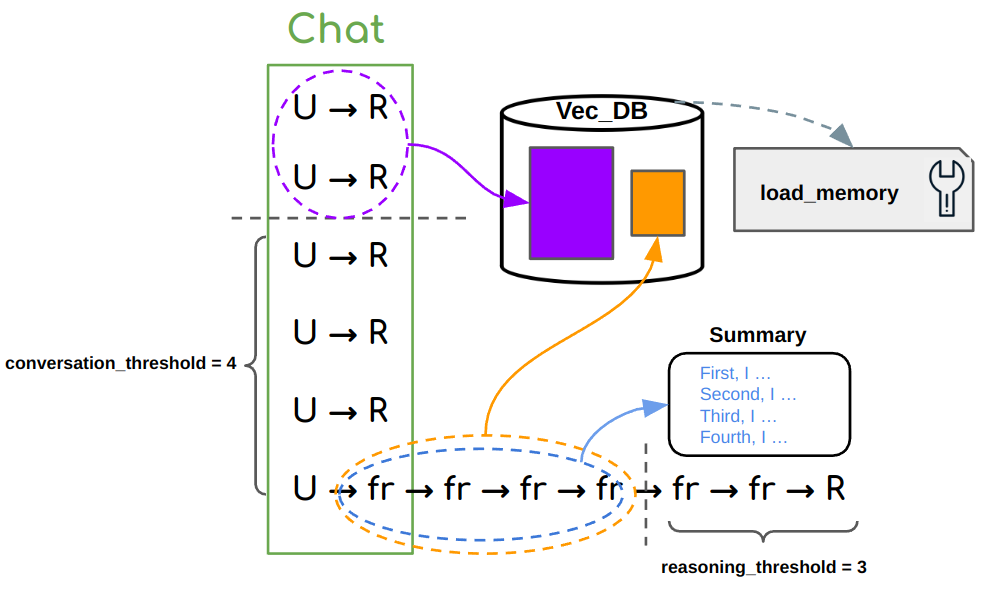
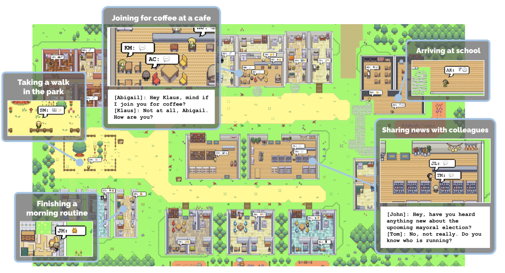

# Agent Components
Here we discuss the details to config different types of agent.

`Agent` is the basic building block of Gentopia. It uses a single `yaml` config file to assemble agent's essential components.
These components include:

- `name`: Unique agent name, visible by other agents.
- `version`: Agent version, can be used to track agent update.
- `type`: Defining the agents' interaction logic with the environment.  
- `description`: Description of agent usage, visible by other agents.
- `target_tasks`: List of tasks or examples the agent is specialized for, non-visible to other agents. 
- `llm`: A dictionary of LLM info driving the agent, including `model_name` and `params`.
- `prompt_template`: A prompt template bound to the agent `type` to instruct `llm` in-context.
- `plugins`: A list of tools or other agents to be invoked by the agent. 
- `memory`: Configurate supported agent `type` to enable long/short term memory retrieval.


## Basics

`name` *String* | Unique identifier of the agent. During agent interaction, it is the keyword to be referred by other agent calls. Therefore you should avoid using lengthy, meaningless or wierd names to confuse LLMs.

`version` *String* | It is non-visible to other agents and only used for tracking agent updates. 

`type` *String* | Defining agent interaction paradigm with plugins. Currently supported types are `vanilla`, `react`, `rewoo`, `openai`, `openai_memory`.

`description` *String* | Description of agent usage. During agent interaction, it is the instruction message sent to other agents. 
You should briefly discuss the strength of this agent, when to use it, expected input/output, any some special notes.

`target_tasks` *List[String]* | Non-visible to other agents. Use it to tell people the expected usage. It will also be used for indexing and agent search in GentPool.


## LLM

`llm` *Dict* | LLM driving the agent behavior. Usually a dictionary of `model_name` and `params`, 
and if the agent type includes multiple LLM instances, specify them separately (see `rewoo` [template](quick_start.md#rewoo-agent) for example).


### OpenAI LLMs
If you specify `model_name` as one of the following, the agent will use OpenAI API for LLM service.

- `gpt-3.5-turbo`
- `text-davinci-003`
- `gpt-4`
- `gpt-3.5-turbo-16k`
- `gpt-4-32k`
- `gpt-3.5-turbo-0613`
- `gpt-4-0613`
- `gpt-3.5-turbo-16k-0613`
- `gpt-4-32k-0613`

The `params` field for OpenAI LLMs contains following optional fields to specify. Here are the default values:

```python
max_tokens: int = 2048
temperature: float = 0.2
top_p: float = 1.0
presence_penalty: float = 0.0
frequency_penalty: float = 0.0
n: int = 1
stop: list = []
```
For the meaning of each parameter, please refer to [OpenAI API](https://beta.openai.com/docs/api-reference/create-completion).
Note that for these models you need to declare your `OPENAI_API_KEY` in the `.env` file as described in [Installation](installation.md#install-gentpool).
As of July 2023, the these models introduce following costs by token usage:

```python
"gpt-3.5-turbo": {"prompt": 0.0015 / 1000, "completion": 0.002 / 1000},
"gpt-4": {"prompt": 0.03 / 1000, "completion": 0.06 / 1000},
"gpt-3.5-turbo-16k": {"prompt": 0.003 / 1000, "completion": 0.004 / 1000},
"gpt-4-32k": {"prompt": 0.06 / 1000, "completion": 0.12 / 1000},
"gpt-3.5-turbo-0613": {"prompt": 0.0015 / 1000, "completion": 0.002 / 1000},
"gpt-4-0613": {"prompt": 0.03 / 1000, "completion": 0.06 / 1000},
"gpt-3.5-turbo-16k-0613": {"prompt": 0.003 / 1000, "completion": 0.004 / 1000},
"gpt-4-32k-0613": {"prompt": 0.06 / 1000, "completion": 0.12 / 1000},
```

### HuggingFace Open LLMs
HuggingFace Open LLMs are model weights from HuggingFace model hub downloaded for [Causal Inference](https://huggingface.co/docs/transformers/tasks/language_modeling).
Gentopia **encourages** use of open LLMs to improve agent scalability and deployability. 
Therefore we support a wide range of them listed in [model_card](https://github.com/Gentopia-AI/Gentopia/blob/c26370cf8c9642d2ec101c2d827b56341058b482/gentopia/resource/model_cards.json)
together with potential 8-bit / 4-bit quantization tricks like [QLoRA](https://github.com/artidoro/qlora). 

To use HuggingFace Open LLMs, specify `model_name` as one of the following:

- `t5-vicuna-3b`
- `replit-3b`
- `camel-5b`
- `mpt-7b`
- `redpajama-7b`
- `redpajama-instruct-7b`
- `alpaca-lora-7b`
- `alpaca-lora-13b`
- `kullm`
- `stablelm-7b`
- `os-stablelm-7b`
- `flan-3b`
- `baize-7b`
- `gpt4-alpaca-7b`
- `vicuna-7b`
- `baize-13b`
- `vicuna-13b`
- `gpt4-alpaca-13b`
- `flan-11b`
- `stable-vicuna-13b`
- `camel-20b`
- `starchat-15b`
- `starchat-beta-15b`
- `evolinstruct-vicuna-7b`
- `evolinstruct-vicuna-13b`
- `guanaco-7b`
- `guanaco-13b`
- `guanaco-33b`
- `falcon-7b`
- `falcon-40b`
- `wizard-falcon-7b`
- `wizard-falcon-40b`
- `airoboros-7b`
- `airoboros-13b`
- `samantha-7b`
- `samantha-13b`
- `samantha-33b`
- `wizard-vicuna-30b`
- `wizardlm-13b`
- `wizardlm-30b`

Following are default values for optional `params` field for you to tweak.

```python
device: str = 'cpu'  # One of ['cpu', 'mps', 'gpu', 'gpu-8bit', 'gpu-4bit']
temperature: float = 0.0
top_p: float = 1.0
max_new_tokens: int = 1024
```

**< Disclaimer >** Due to short of resource, we are not able to test all the models as of July 2023. 
So using above OpenLLMs might introduce unexpected errors or performance. If you do, please pin us under [Issues](https://github.com/Gentopia-AI/Gentopia/issues).
There are tons of upcoming Open LLMs we plan to test and build into Gentopia, such as [Llama2](https://huggingface.co/docs/transformers/main/model_doc/llama2). 
Most importantly,  **NOT** all Open LLMs allow commercial use. Please check the license of each model on HuggingFace before using them for commercial purposes.
Gentopia unconditionally aligns with the license of the original model and does not take any responsibility for the license violation.

### Other LLM Source
We don't yet support other LLM as of July 2023. However, we are aware of some excellence for the following LLM sources 
and plan to include them in the near future.

- [`Anthropic Claude 2`](https://www.anthropic.com/index/claude-2) with 100k max context length, especially powerful for long context usage.
- `Google Bard` seems like the first published LLM for inherit Multi-Modality.


## Prompt Template

PromptTemplate is basically an *f-string* template with variable placeholders and validation check. Since strings are the 
primary methods to communicate among LLMs, we create a placeholder for custom variables while fixing the major structure 
that defines LLM completion paradigm. 

For clarity of config, `prompt_template` is usually coupled with `!prompt` config operator to hint the agent assembler to look for 
corresponding `PromptTemplate` instance in working environment. Following are built-in prompts default to each agent types.

### Vanilla, OpenAI, OpenAI_Memory
```python
from gentopia import PromptTemplate

VanillaPrompt = PromptTemplate(
    input_variables=["instruction"],
    template="""{instruction}"""
)
```

### ReAct
```python
from gentopia import PromptTemplate

ZeroShotReactPrompt = PromptTemplate(
    input_variables=["instruction", "agent_scratchpad", "tool_names", "tool_description"],
    template=
"""Answer the following questions as best you can. You have access to the following tools:
{tool_description}.
Use the following format:

Question: the input question you must answer
Thought: you should always think about what to do

Action: the action to take, should be one of [{tool_names}]

Action Input: the input to the action

Observation: the result of the action

... (this Thought/Action/Action Input/Observation can repeat N times)
#Thought: I now know the final answer
Final Answer: the final answer to the original input question

Begin! After each Action Input.

Question: {instruction}
Thought:{agent_scratchpad}
    """
)
```

### ReWOO

```python
from gentopia import PromptTemplate

ZeroShotPlannerPrompt = PromptTemplate(
    input_variables=["tool_description", "task"],
    template=
"""You are an AI agent who makes step-by-step plans to solve a problem under the help of external tools. 
For each step, make one plan followed by one tool-call, which will be executed later to retrieve evidence for that step.
You should store each evidence into a distinct variable #E1, #E2, #E3 ... that can be referred to in later tool-call inputs.    

##Available Tools##
{tool_description}

##Output Format (Replace '<...>')##
#Plan1: <describe your plan here>
#E1: <toolname>[<input here>] (eg. Search[What is Python])
#Plan2: <describe next plan>
#E2: <toolname>[<input here, you can use #E1 to represent its expected output>]
And so on...
  
##Your Task##
{task}

##Now Begin##
"""
)

ZeroShotSolverPrompt = PromptTemplate(
    input_variables=["plan_evidence", "task"],
    template=
"""You are an AI agent who solves a problem with my assistance. I will provide step-by-step plans(#Plan) and evidences(#E) that could be helpful.
Your task is to briefly summarize each step, then make a short final conclusion for your task.

##My Plans and Evidences##
{plan_evidence}

##Example Output##
First, I <did something> , and I think <...>; Second, I <...>, and I think <...>; ....
So, <your conclusion>.

##Your Task##
{task}

##Now Begin##
"""
)
```

**< Important >** When you customize your own prompt, do **NOT** change the `input_variables` field since they are expected 
by each agent `type`. Instead, you can create some context shift by adding hints, rules, identity, etc, to optimize your agent
response for targeted tasks. Finally, you can use `!prompt` operator to use your customized prompt in config. 
Check out this short [tutorial](https://www.youtube.com/watch?v=diJ4IDaT4Z4) for example.


## Plugins

Plugins enables agents to interact with external tools or other agents.
LLMs can benefit from plugins to extend their capabilities beyond language models, namely

- Retrieve unseen / unmemorized *world knowledge* during pretraining. eg. News, private data of your company, complex math problems, etc.
- Take *actions* influencing the environment. eg. Tweeting, sending emails, etc.

`plugins` is a List of *Either[BaseTool, BaseAgent]* during config.

### Tool as Plugin

Tools are basically function calls in which you can pass API invocation, command execution, etc. Gentopia host an expanding amount of built-in tools.
Check out GentPool [Wiki](https://github.com/Gentopia-AI/GentPool/wiki/Tools) for some of them. 
To use built-in tools, simply specify `name`:*String* and an optional `param`:*Dict* if needed (which will be passed to tool function at initialization).

And of course, you can easily extend `BaseTool` to provide a `run` function for your own tool, and use `!tool` operator to use it in config.
Check out this short [tutorial](https://www.youtube.com/watch?v=diJ4IDaT4Z4) for example.


### Agent as Plugin

Using agent as plugin enables a single agent to interact with other agents. This simple idea can be much powerful than it seems.

- Convenience - Lots of core abilities are universally demanded. eg. an agent specialized in mathematically reasoning, an agent specialized in online retrieval, etc. You shall easily include these agents from GentPool in one line instead of doing it yourself.
- Specialization - Multiple ALM researches have shown that stacking irrelevant plugins, no matter in-context or through SFT, can hurt system performance. Imagine you are building a multi-task agent assisting in academic writing, decoupling tool sets for online search & summarization as one agent, and tool sets for mathematical reasoning as another, should both improve agent performance and reduce computation complexity than if you feed all tools to a single agent in one layer.

To use Agent as plugin, simply use `!include` operator to read yaml config of another agent as demoed in this [tutorial](https://www.youtube.com/watch?v=diJ4IDaT4Z4).
You can find public agents, together with their eval info in GentPool [Wiki](https://github.com/Gentopia-AI/GentPool/wiki/Agents).


## Memory 

Memory refers to a component enabling LLM to retrieve information out-of-context. 
This is usually necessary if we want to share "environmental" information to LLMs, 
when they get limited by *max_token* or lack of observation spontaneity of the env.

Early 2023, this idea of memory gives an impetus to vector database, using ANN algorithms for fast neighbor retrieval.
There's a rough idea to add historical context of LLM into vector databases, update index, and retrieve related corpus when needed.
In practice, however, the performance of memory hugely depends on implementation details such as where to index, where to summarize
and when to retrieve,etc.

Besides, the field of adaptive weight update by context is still in its infancy. We do **NOT** think summarization and index retrival
is the most elegant and efficient solution for memory, but we still implement a relatively robust and speedy solution with only ~10% time overhead (see below).
Meanwhile, it is also one of Gentopia's missions to explore other possibilities.

### Long & Short Term Memory

`memory` component is used for one of the following purposes:

- Escaping context limitation of LLMs. eg. when you expect a very long conversation or task solving trajectory, exceeding the *max_token* limit of LLMs.
- Saving token consumption. eg. when you expect to have lengthy and unnecessary tool response (like Wikipedia Search) stored in-context.

In both cases, we use `memory` to store context ahead of a "threshold" into vector database, replacing it with some
short "summary", and retrieve the original corpus for more details when needed later. The term *Long Term Memory*
refers to the part in vector database, while *Short Term Memory* refers to the part in LLM context.

**<2-LEVEL Memory Implementation>**
Here is a memory template used for `openai_memory` agent.
```yaml
memory:
  memory_type: chroma
  conversation_threshold: 2      # first-level memory
  reasoning_threshold: 2         # second-level memory
  params:
    index: main
    top_k: 2
```

**Level I** --  Given a conversation of multiple `(U,R)` pairs, where `U` denotes *User Input* and `R` denotes *Agent Response*, 
we use `conversation_threshold` to determine the maximum number of recent `(U,R)` pairs to be stored in LLM context.
`(U,R)` before the threshold will be incrementally injected to the vector database.

**Level II** -- When new `U` is received, it can take arbitrary number of `fr`, denoting *Function Response*, for the agent
to take mult-step reasoning/actions that finally lead to `R`. We use `reasoning_threshold` to determine the maximum 
number of recent `fr` to be stored in LLM context, before which `fr` are incrementally injected to the vector database. 
Meanwhile, for the continuity of reasoning trajectory, each cached `fr` are summarized shortly into a sentence like "First, I xxx",
and written into a "Summary scratchpad", replacing `fr` in context. In practice, this could save thousands of tokens
per `(U,R)` especially when `fr` is very long (like Wikipedia Search). 

**Memory Retrieval** -- Once the vector database is initiated, a companion `load_memory` plugin indexing on the vector database is automatically attached to
the agent. The agent can call `load_memory` with a search query at anytime if it decides to retrieve relevant corpus.




**Other Parameters** -- `memory_type` specifies the type of vector database. Currently, we support `chroma` and `pinecone`.
We recommend to start with `chroma` for its key-free access. `params` is a Dict of parameters passed to vector database,
where `index` is the name you give to the index, and `top_k` is the number of neighbors to retrieve for `load_memory` plugin.

### Static & Shared Memory

Another type of memory refers to the shared information visible to all agents in a same environment.
Agents have access to read and write to such memory when needed. Such memory can also get updated by 
the environment itself, eg. to post events or notifications. This idea comes from some multi-agent simulations
like [Generative Agents](https://arxiv.org/pdf/2304.03442.pdf) (picture below), [Voyager](https://arxiv.org/abs/2305.16291) and AI South Park. Gentopia is now implementing a 
similar agent `type` called `gentenv` to enable such feature.




Unlike the previous Long/Short Term memory which uses vector database for neighbor search, static/shared 
memory can be implemented by faster and cheap structured data like Hashmaps, or NoSQL database like `mongoDB`. 


