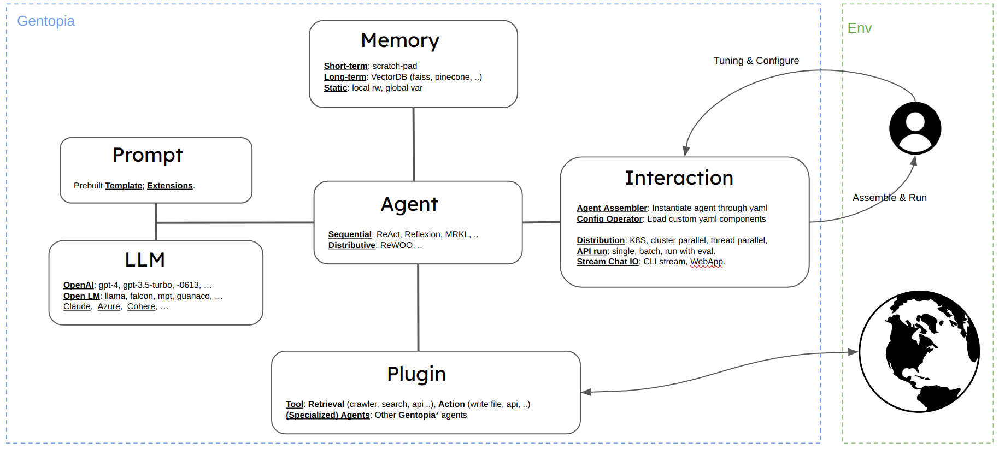

# Introduction
Gentopia is a lightweight and extensible framework for LLM driven autonomous Agent.
It provides multiple essential components to build, test and evaluate agents. 
At its core, Gentopia aims to embody agents with single config files, thus minimizing your effort in maintaining, tuning, and sharing agents.

Gentopia maintains a pool ([GentPool](https://github.com/Gentopia-AI/GentPool)) to share public agents specialized for different tasks. 
In this platform, you could easily call other agents for interaction, extend and optimize agent components towards your needs. 
You can also publish your specialized agent to get our unique benchmark eval and share your agent with the world.


## Motivation
Think of building a *real* AI assistant. Do we really need a >> 175B GPT-4 to summarize Web search or `print("helloworld")`? Recent studies like [TinyStories](https://arxiv.org/abs/2301.12726), [Specializing Reasoning](https://arxiv.org/abs/2301.12726), [Let's Verify SbS](https://arxiv.org/abs/2305.20050), [ReWOO](https://arxiv.org/abs/2305.18323), etc. point us towards an intuitive yet undervalued direction 👉 

```text
An LLM is more capable if you create a context/distribution shift narrowed to some target tasks.
```
Sadly, there is no silver bullet for agent specialization. For example, you can 
- Simply add `Let's think step by step.` in your **prompt** for more accurate Math QA.
- Give a **few-shot** exemplar in your prompt to guide a better reasoning trajectory for novel plotting.
- Supervise **fine-tuning** (SFT) your 70B `llama2` like [this](https://arxiv.org/abs/2305.20050) to match reasoning of 175B GPT-3.5.
- Tune your agent **paradigm** like this [demo](https://www.youtube.com/watch?v=diJ4IDaT4Z4) to easily half the execution time for Seach & Summarize.
- And more ...

Isn't that beautiful if one shares his specialized intelligence, allowing others to reproduce, build on, or interact with it at ease? This belief inspires us to build Gentopia, 
**a convenient framework for agent *specialization, sharing, and interaction,* encouraging collective growth to greater intelligence**.
## Gentopia

[Gentopia](https://github.com/Gentopia-AI/Gentopia) is the core framework, providing pre-built and extensible components to assemble agents.



We provide an expanding number of essential components -- Agent type, LLM, Plugins, Memory, etc. We also make the base classes simple and lightweight, so you can easily extend and customize your own components.


## GentPool

[GentPool](https://github.com/Gentopia-AI/GentPool) is an application built on Gentopia, providing a platform for agent sharing, interaction and evaluation.
It consists of two parts:

- pool: The agent zoo. Each agent consists of a core config file and some optional companion files defining custom components.
- bench: Our unique agent eval benchmark. It tests a wide range of agent capability beyond vanilla LLMs.

